# АВТОМАТИЗАЦИЯ ПОЛУЧЕНИЯ ТОКЕНА В POSTMAN

> ## Задание: пользователь получает уникальный токен при авторизации. Автоматизировать подстановку полученого токена при отправке запроса пользователем.
> ### Условие: при выполнении задания использовать Postman. Выбрать любой сайт способный отдавать токен.

### Решение задачи:
### 1. Выбранным сайт deviantart.com 
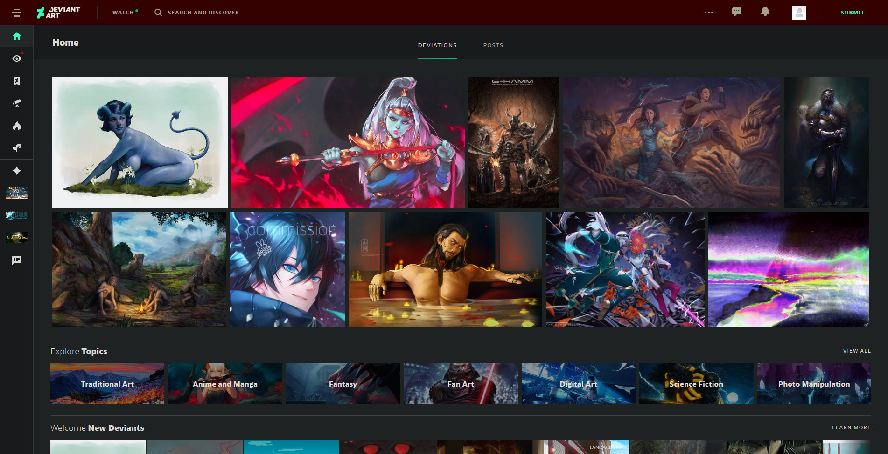

### 2. Необходимо пройти процедуру регистрации и авторизации на сайте. Перейти по адресу deviantart.com/developers и зарегистрировать свое приложение.
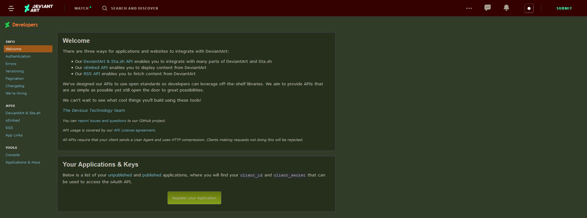

### 3. Пройдя регистрацию получаем `client_id` и `client_secret`.
### 4. На странице deviantart.com/developers/authentication описан способ получения токена и ввода необходимых параметров.
> **Client Credentials**
> The Client Credentials gives your app access to our "public" endpoints and do not require user authorization. An overview of the authentication flow is illustrated below:
> 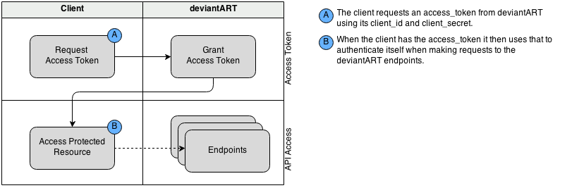
> **Getting A Client Access Token**
>To obtain a client access token, you simply request a token using your clients **client_id** and **client_secret**.
>
>***Parameters***
>
>**POST, GET client_id (integer)**:
>required
> __Your app's client_id (obtained during app registration) client_id and client_secrect can be provided via HTTP Basic Authentication see__ http://tools.ietf.org/html/rfc6750#section-2.1
> 
>**POST, GET client_secret (string)**:
>required	
>__Your app's client_secret (obtained during app registration)
>client_id and client_secrect can be provided via HTTP Basic Authentication see__ http://tools.ietf.org/html/rfc6750#section-2.1
>
>**POST, GET grant_type (string)**:
>required	
> __The value must be client_credentials__

Запрос на получения токена отсылается на ` https://www.deviantart.com/oauth2/token`

### 5. Заполненая вкладка Autorization в Postman  имеет вид
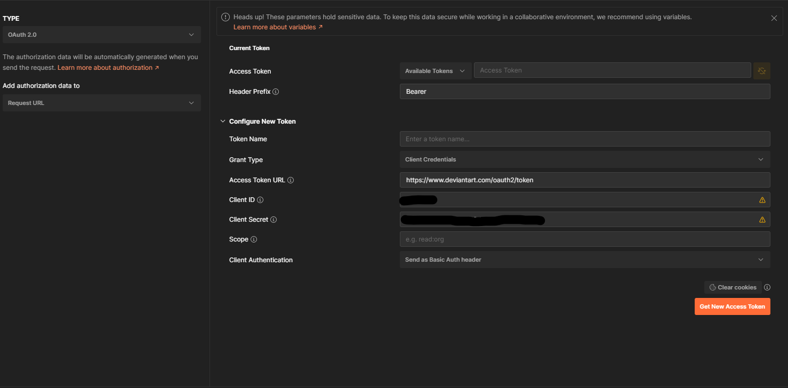
>****TYPE****
Тип авторизации: OAuth 2.0
Add autorization data to: Request url
>****Current Token****
Header Prefix: Bearer
Grand Type: Client Credentials
Access Token URL: `https://www.deviantart.com/oauth2/token`
Client ID: client_id
Client Secret: client_secret
Client Authentication: Send as Basic Auth header

Для проверки введенных данных кликаем на кнопку ****Get New Access Token****.
Приложение уведомляет, что токен получен.

> 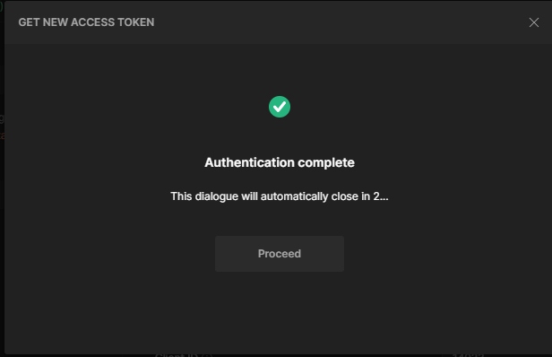

>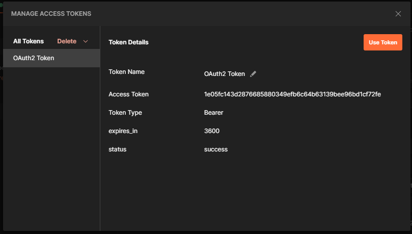

Кликаем на кнопку **Use Token**. Токен добавился а поле **Access Token**.

>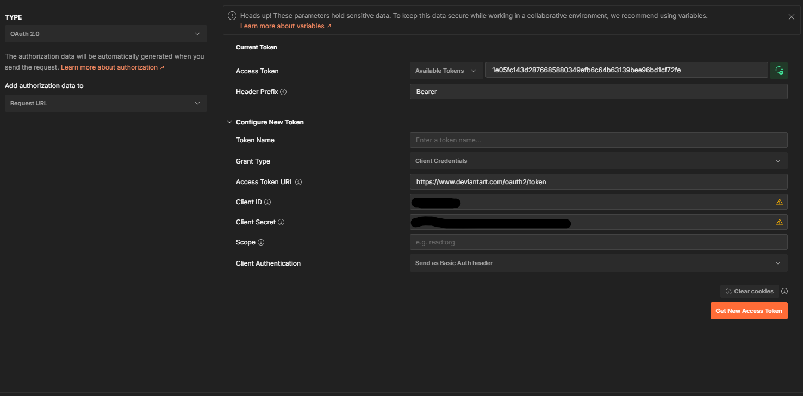

### 6. deviantart.com/developers/console содержит точки входа и параметры для запроса. В качестве эксперимента будет использован поиск по тэгу.

Ссылка: deviantart.com/developers/console/browse/browse_tags/

> 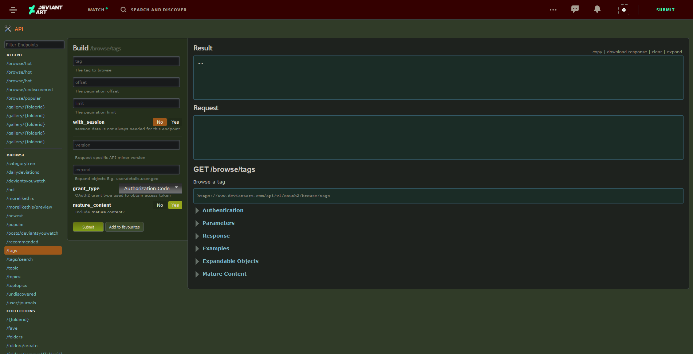

Заполняем минимальное количество полей и отправляем запрос кнопкой ****Submit****

>**Результат**
> 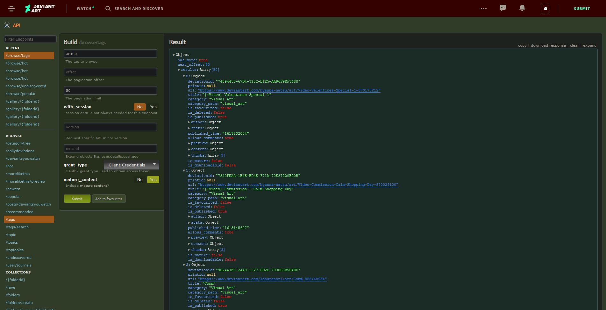

>**Внизу страницы был сгенирирован запрос**
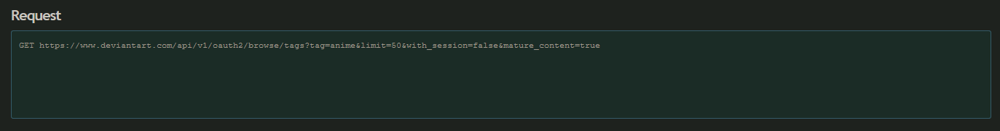

### 7. Вставляем запрос редактируя необходимыя поля
**Status 200 OK** - успешно успешно выполнен.
>Ответ от сервера
> 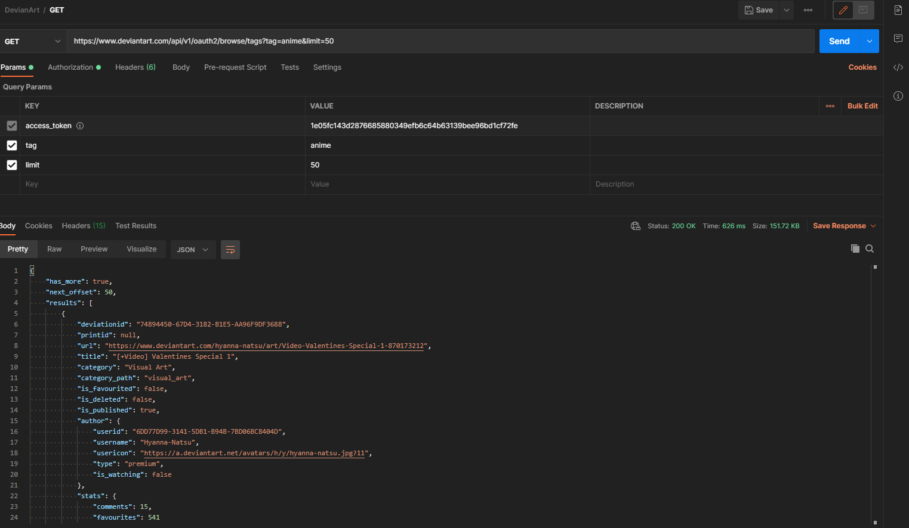

### 8. Удаляем заполненные значения и отправляем запрос.
>Ответ сервера: **Status: 401 Unautorized**
> 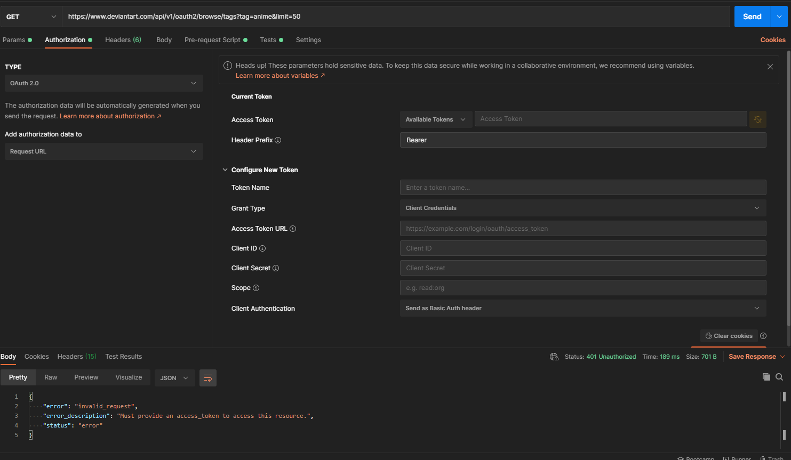

> Проверка вкладки **Params**. Поле - **aceess_token** пустое.
> 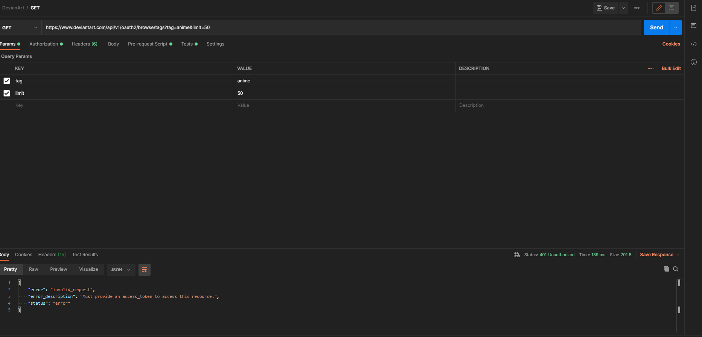

### 9. Записываем данные в переменные.
> Для начала заполним в рамках колекции переменные для использования.
> 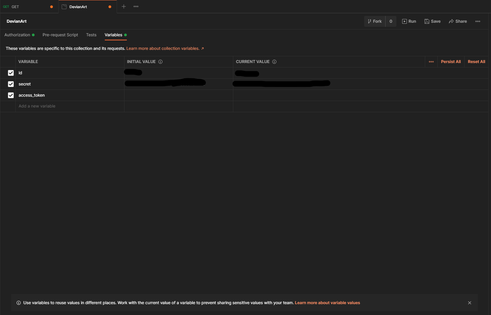

**id** - id полученый при регистрации приложения.
**secret** - секреный пароль при регистрации приложения
**access_token** - полученный токен

> отправляемый параметр **access_token** добавляем во вкладку **Params**. Поле **VALUE** оставляем пустым - в него будут записываться значения полученного токена.
>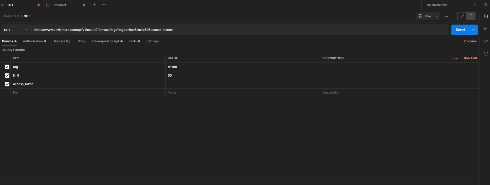

### 9. Вкадка **Pre-request Script** служит для действий, которые будут сделаны перез отправкой запроса.

В этой вкладке необходимо получить токен и записать его в переменную **access_token**.

```
pm.sendRequest(`https://www.deviantart.com/oauth2/token?client_id=${pm.variables.get('id')}&client_secret=${pm.variables.get('secret')}&grant_type=client_credentials`, (error, response)=>{
    if(error){
        console.log(error)
    }else{
         pm.variables.set('access_token', response.json().access_token)
         }
});
```
> Комманда для отправки запроса содержит
>- адрес
>- переменные **id**
>- переменные **secret**
>- тип авторизации
> - после запятой указаны параметры функции ответа

>Комманду можно прочитать так:
> Отправь запрос на получение токена. Если ошибка, то отобрази ошибку в консоль. Иначе - запиши в переменную **access_token** полученый токен.
> 
>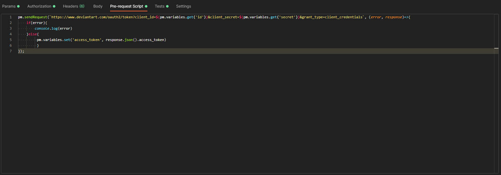

### 10. Вкладка Tests содержит действия, которые будут выполнены после выполнения запроса
```
if (pm.response.to.be.ok){
    pm.response.to.have.status
}else{
    pm.response.to.have.status
}
```
>Комманду можно прочитать так:
> Если статус ответа ОК - отобразить статус. Иначе - отобрази полученный статус.
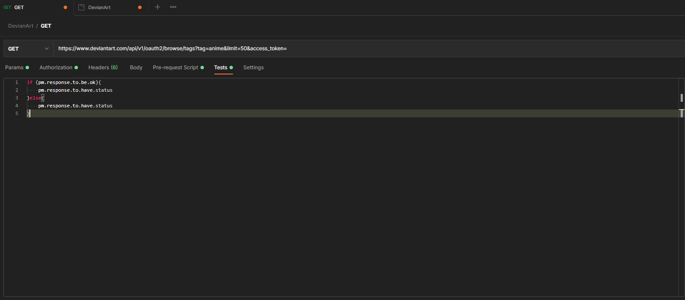

### 11. Во вкладке Params заполняем поле access_token.
>В **access_token** в поле **VALUE** вставляем переменную, которая будет получать токен.
```
> При переключении режима отображения параметров (Bulk Edit)
tag:anime
limit:50
access_token:{{access_token}}
```
 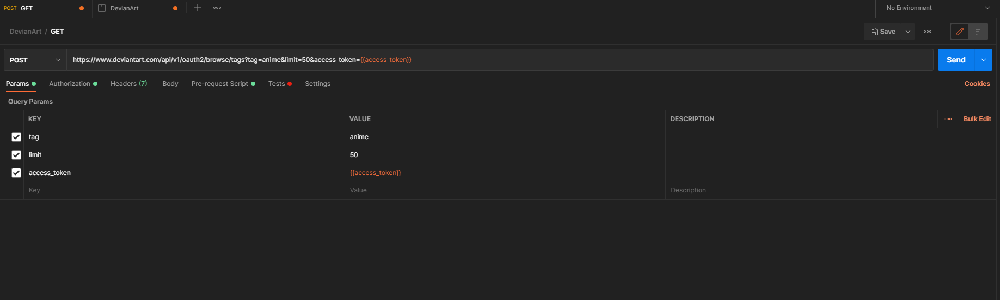  

 ### 12. Полученный результат.
 >Отправляем данные **POST** методом.
 >

 > **P.S.** будьте внимательными, название отправляемого параметра и переменной совпадает. Можно использовать свое название используемой переменной. 