# Example: 10 minute load testing of a site beta.anibel.net
----------


## Step one
### Go to the bin folder in "apache-jmeter*you-version" folder 
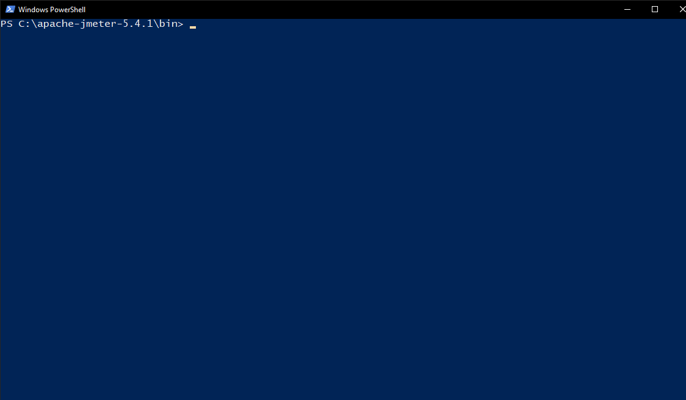

## Step two
### Run the command "./jmeter"


## Step three
### Click on the book icon
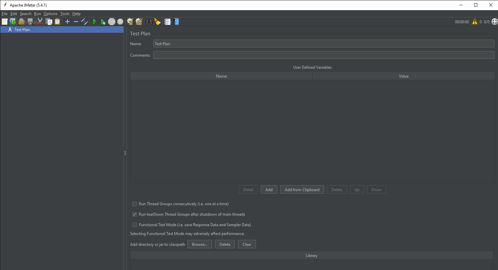

## Step four
### Select the Recording parameter
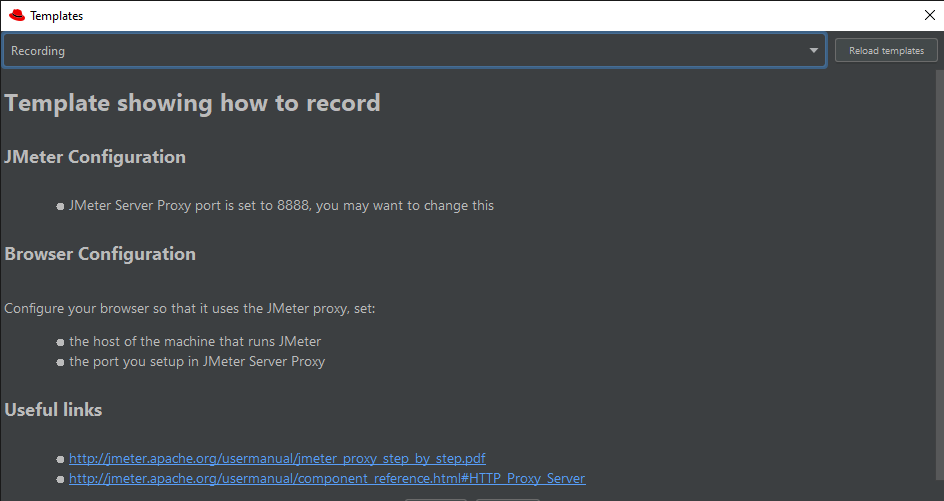

## Step five
### Enter data in input fields
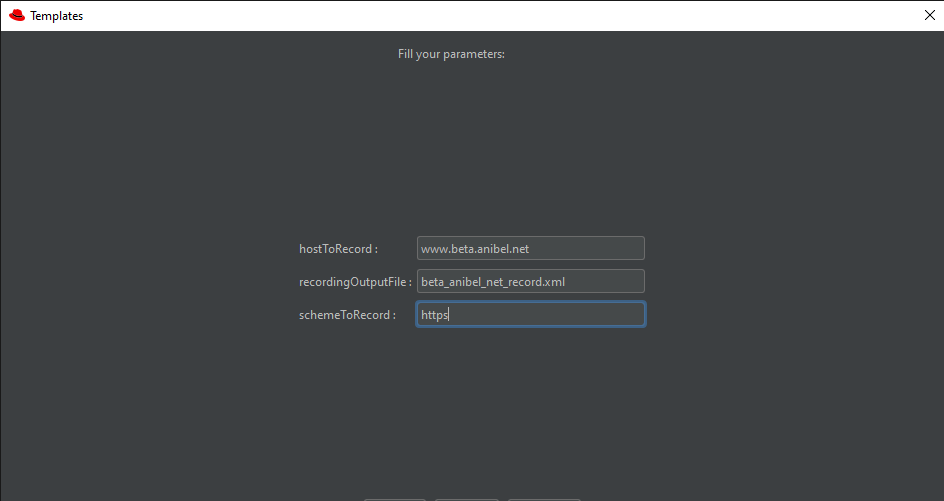

## Step six
### Go to gtmetrix.com. Log in to the site and in the "Enter URL .." field enter the name of your web page. Click the Analize and wait a few seconds.
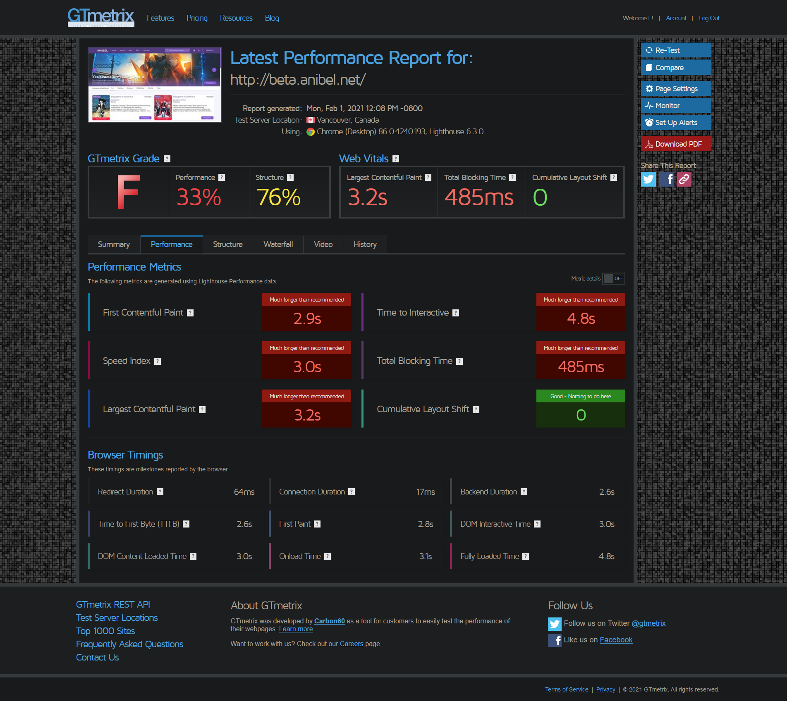

## Step seven
### Download and open the document containing analysis data.
### Find the page as shown below. We are interested in the number of requests. In my case it is 42
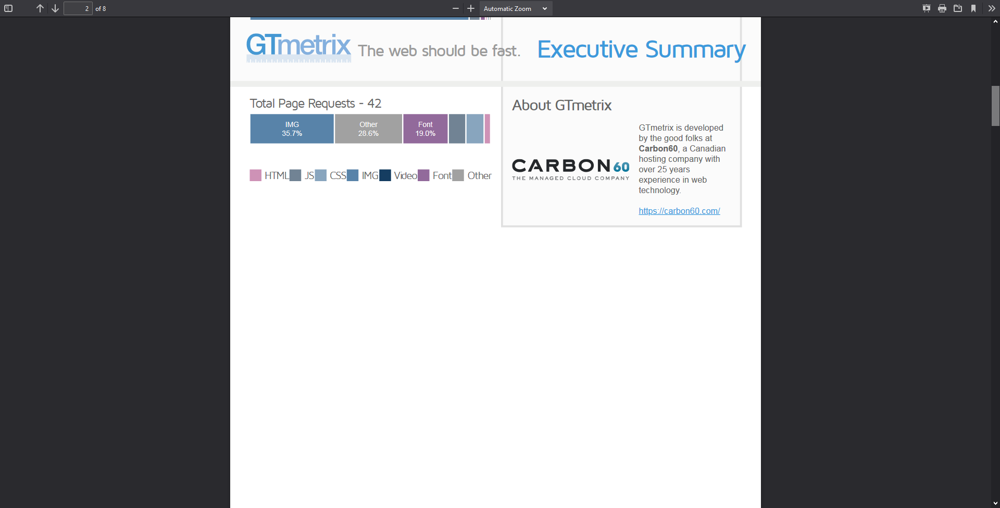

## Step eight
### Enter your details in the Thread Group and drag HTTP Request Defaults down.
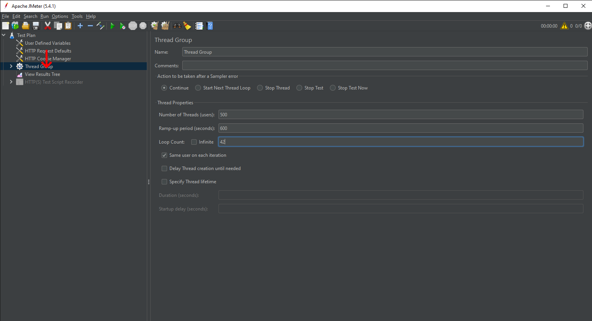 

## Step nine
### Click RBM on the Thread Group and select the HTTP Request
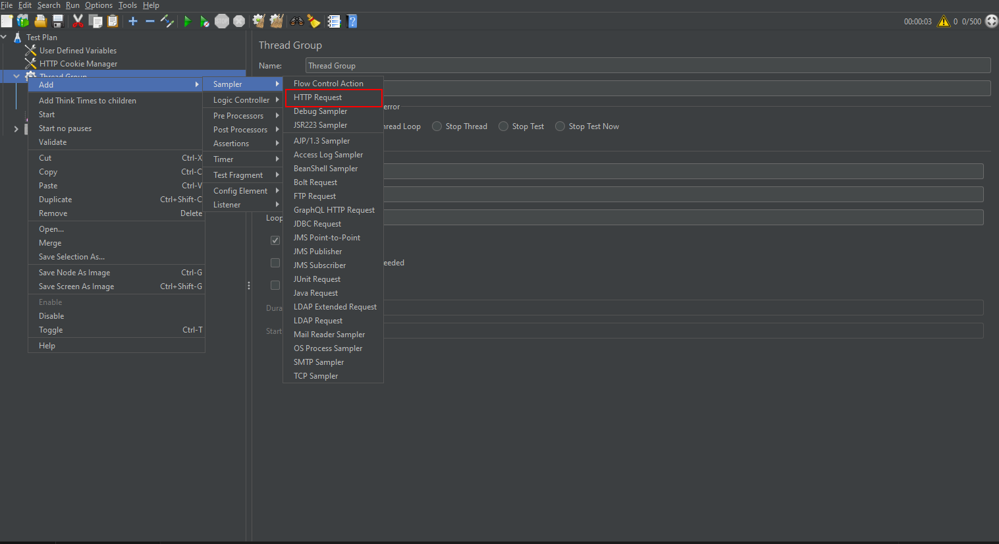

## Step ten
### The structure of the fields should look something like this.
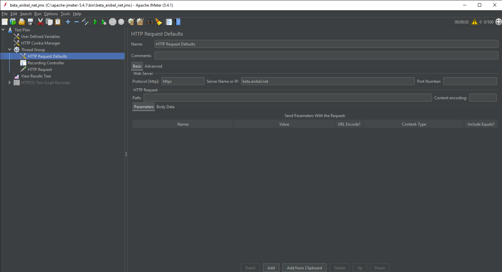

## Step eleven
### Save the Test Plan
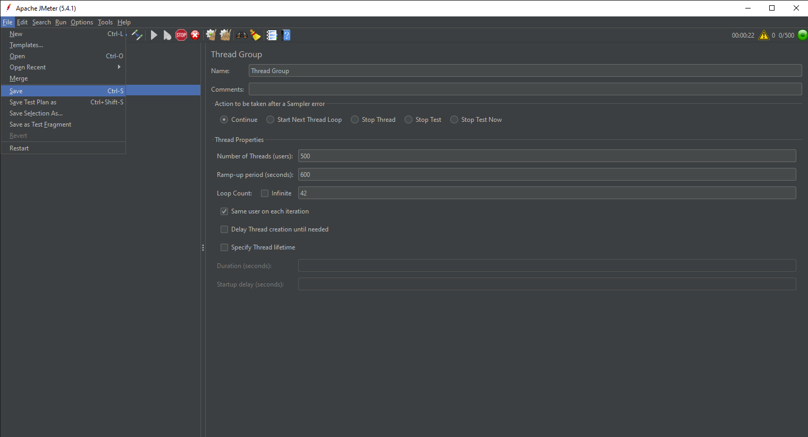

## Step twelve
### Close JMeter. Start testing with the command

```
.\jmeter -n -t .\beta_anibel_net.jmx -l beta_anibel_net_log.txt
```
`-n - This specifies JMeter is to run in cli mode`

`-t - [name of JMX file that contains the Test Plan].`

`-l - [name of JTL file to log sample results to].` for writing data in the .txt file

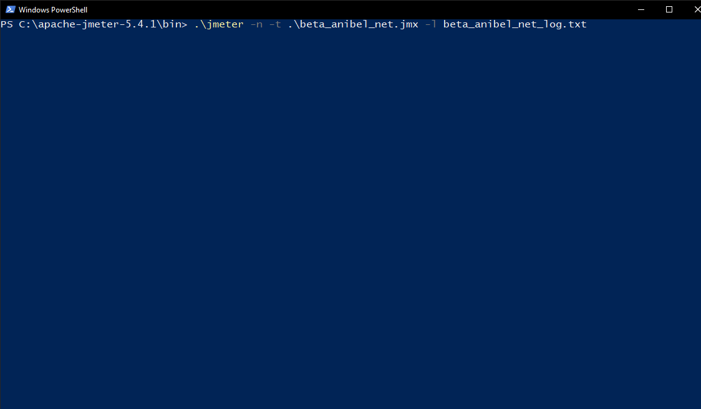
### or the command
```
.\jmeter -n -t .\beta_anibel_net.jmx -l beta_anibel_net_log.csv
``` 
### for writing data in the .csv file
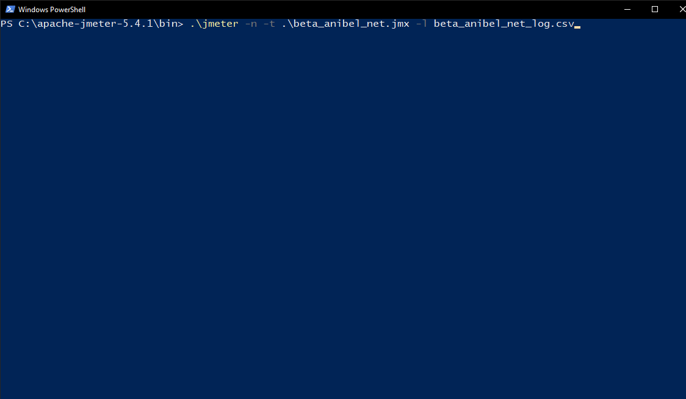

## Step thirteen
### Just wait
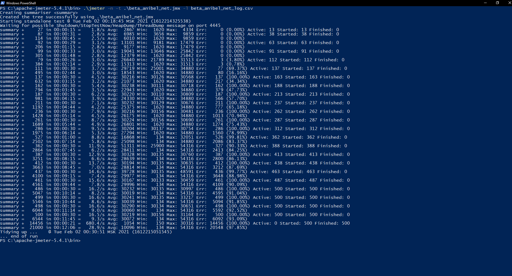

## Step fourteen
### The file can be opened or ... can be edited in HTML format
```
.\jmeter -e -g .\beta_anibel_net_log.csv -o .\report\
```
`-e - generate report dashboard after load test`

`-g - [path to CSV file] generate report dashboard only`

`-e - output folder where to generate the report dashboard after load test. Folder must not exist or be empty`

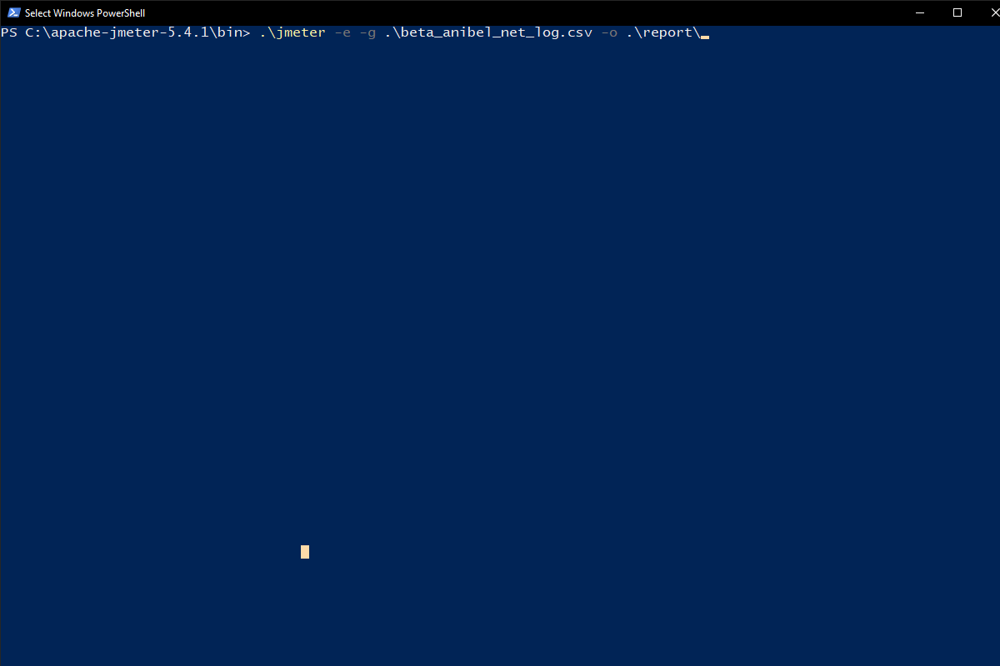

## Step fifteenth
### Open the index.html file in a browser or open [this](./report/index.html) file
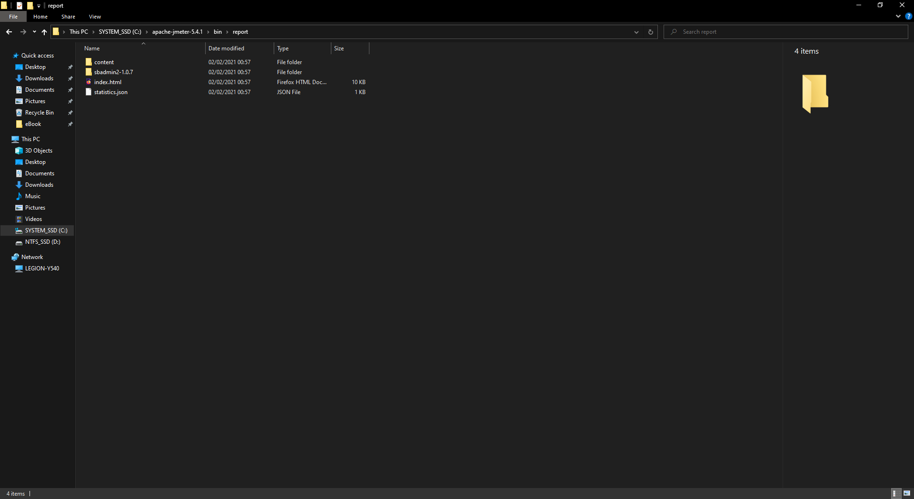

----------
