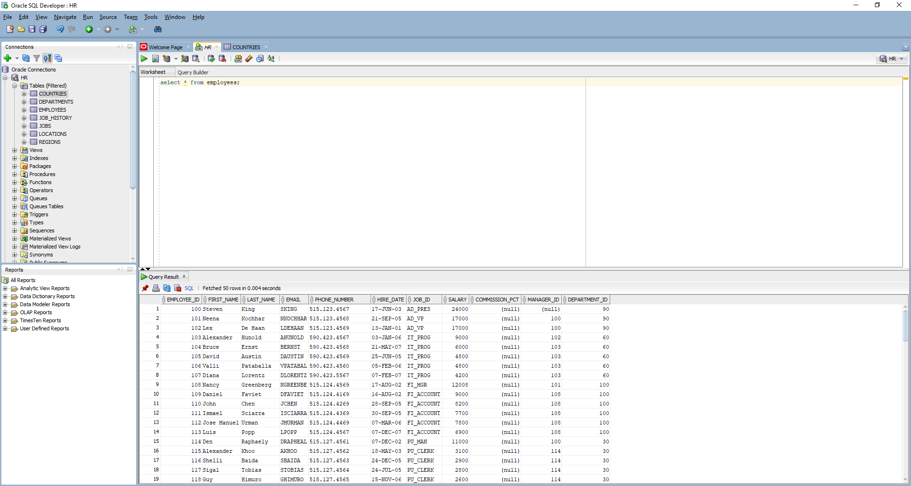
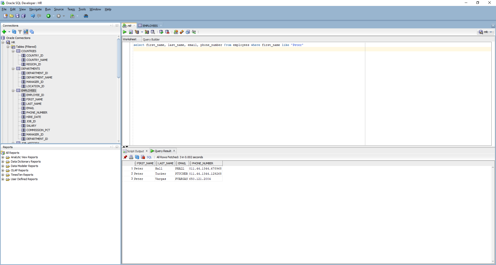
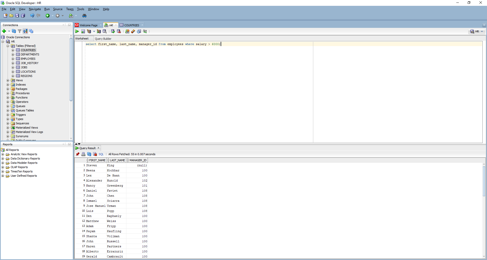
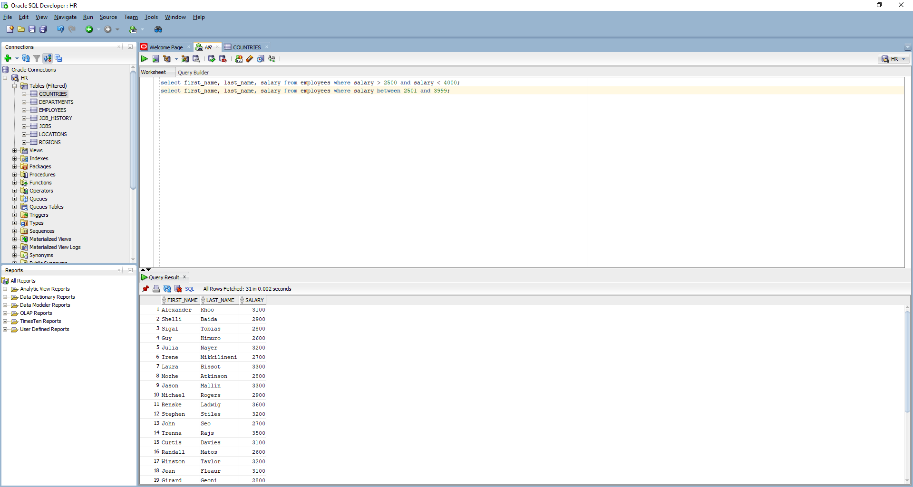
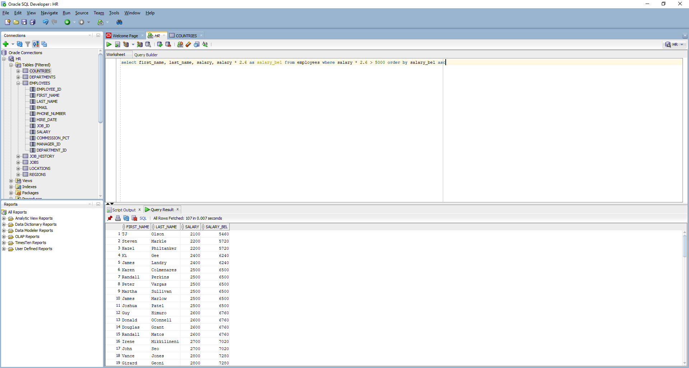
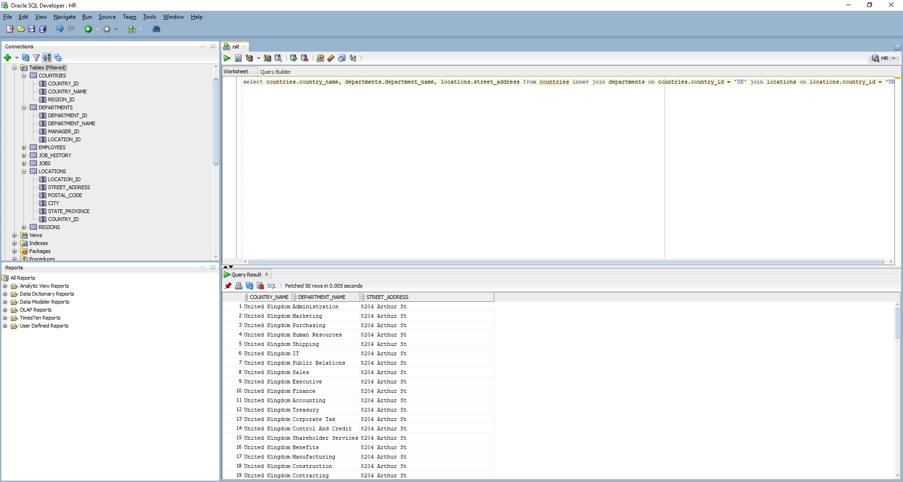
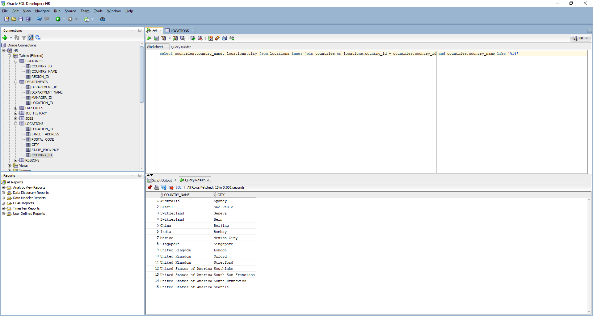
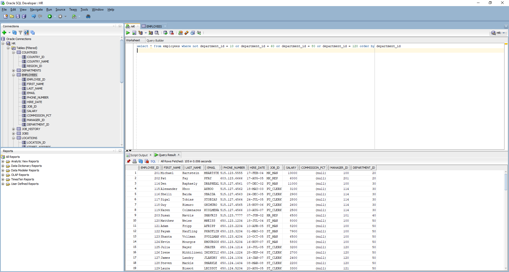

# Работа с базами данных на осное MySQL.

## Задания для выполнения:

>### Задание 1: Выполнить запрос, выводящий все строки из таблицы Employees.

```select * from employees```

>

___

>### Задание 2: Выполнить запрос, который выведет отсортированные по первой колонке данные таблицы Employees.   

`select * from employees order by employee_id` + asc|desc

>
___

> ### Задание 3: Выведите имя, фамилию, email, телефон сотрудников, которых зовут Peter.

1. `select first_name, last_name, email, phone_number from employees where first_name='Peter'`
2. `select first_name, last_name, email, phone_number from employees where first_name like 'Peter'`


___


>### Задание 4: Выведите имя, фамилию и идентификатор сотрудников, у которых зарплата более $6000.

>```select first_name, last_name, manager_id from employees where salary > 6000;```


___

> ### Задание 5: Выведите имя, фамилию и зарплату сотрудников, которые получают больше, чем \$2500 и меньше, чем $4000.
1. `select first_name, last_name, salary from employees where salary > 2500 and salary < 4000;`
2. `select first_name, last_name, salary from employees where salary between 2501 and 3999;`
>
___
> ### Задание 6: Выведите имя, фамилию, зарплату в долларах и зарплату в рублях (можно выбрать валюту своей страны) по текущему курсу для тех сотрудников, которые получают более 5000 рублей (считайте, что в таблице зарплата указана в долларах).
`select first_name, last_name, salary, salary * 2.6 as salary_bel from employees where salary * 2.6 > 5000 order by salary_bel asc`
>
___

> ### Задание 7: Выведите все адреса из Великобритании с указанием отделов, которые по этим адресам находятся. (связь таблиц Countries, Locations)
1. `select departments.department_name, locations.street_address, locations.country_id from  departments inner join locations on locations.country_id = 'UK'`


>

2. `select countries.country_name, departments.department_name, locations.street_address from countries inner join departments on countries.country_id = 'UK' join locations on locations.country_id = 'UK'`

>
___

> ### Задание 8: Выведите все страны, название которых содержит букву "i". Вывести страну и город.

`select countries.country_name, locations.city from locations inner join countries on locations.country_id = countries.country_id and countries.country_name like '%i%'`

>
___

> ### Задание 9: Выведите менеджеров для всех отделов кроме 10, 60, 80, 120.
`select * from employees where not department_id = 10 or department_id = 60 or department_id = 80 or department_id = 120 order by department_id`
>
___